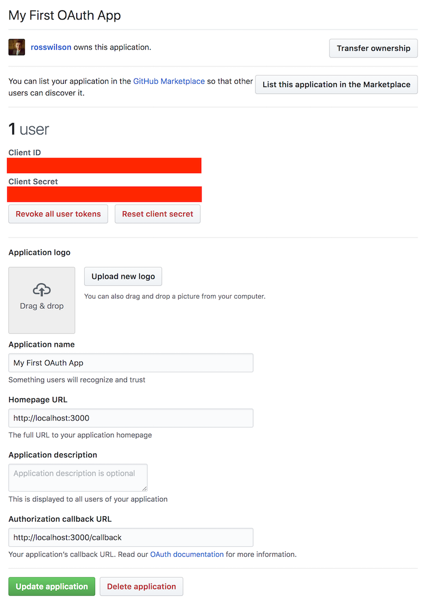

# Simple GitHub OAuth Example

A quick example of authenticating a user via an OAuth 2.0 Authorization Code
Grant flow, using GitHub as the authentication service.

## Getting Started

```
git clone git@github.com:rosswilson/github-oauth-example
cd github-oauth-example
npm install
```

[Create a new OAuth application](https://github.com/settings/applications/new)
and ensure your Authorization Callback URL is set to `http://localhost:3000/callback`.



Take a note of your `Client ID` and `Client Secret`, you'll set environment variables
to pass these to the Node.js application.

Run the server with:

```
CLIENT_ID=abc123 CLIENT_SECRET=xyz123 npm start
```

Now visit [http://localhost:3000](http://localhost:3000/).

## URLs

* [/](http://localhost:3000/)
* [/login](http://localhost:3000/login)
* [/repos](http://localhost:3000/repos)
